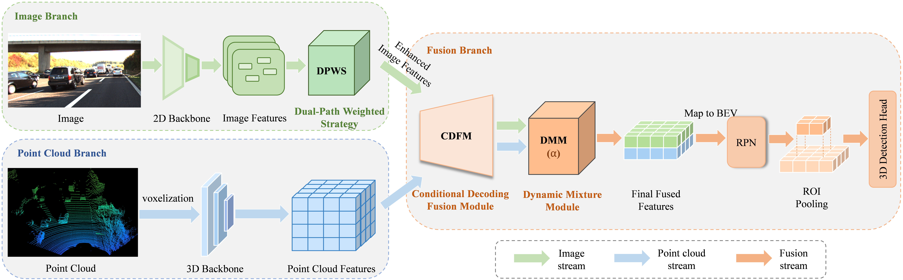

# HFA-Net

We have proposed HFA-Net（HFA-Net:Hierarchical Feature Alignment Network for Multimodal 3D Object Detection）, which is used for three-dimensional object detection that integrates camera and point cloud modalities.


**Highlights**: 
* HFA-Net effectively addresses the problem of hierarchical feature misalignment.
* DPWS enhances the robustness of image features.
* CDFM achieves semantic alignment via variational probabilistic fusion.
* DMM enables adaptive fusion at the decision-weight level.

### Installation
1.  Prepare for the running environment. 

    You can  follow the installation steps in [`OpenPCDet`](https://github.com/open-mmlab/OpenPCDet). We use 1 RTX-4090 GPU to train our HFA-Net.

2. Prepare for the data.  
    
    The dataset is follow [`FocalsConv`](https://github.com/JIA-Lab-research/FocalsConv). Anyway, you should have your dataset as follows:

    ```
    HFA-Net
    ├── data
    │   ├── kitti_pseudo
    │   │   │── ImageSets
    │   │   │── training
    │   │   │   ├──calib & velodyne & label_2 & image_2 & (optional: planes) & depth_dense_twise & depth_pseudo_rgbseguv_twise
    │   │   │── testing
    │   │   │   ├──calib & velodyne & image_2 & depth_dense_twise & depth_pseudo_rgbseguv_twise
    │   │   │── gt_database
    │   │   │── gt_database_pseudo_seguv
    │   │   │── kitti_dbinfos_train_custom_seguv.pkl
    │   │   │── kitti_infos_test.pkl
    │   │   │── kitti_infos_train.pkl
    │   │   │── kitti_infos_trainval.pkl
    │   │   │── kitti_infos_val.pkl
    ├── pcdet
    ├── tools
    ```
    .

3. Setup.

    ```
    conda create -n HFA_env python=3.8
    conda activate HFA_env
    
    pip install torch==1.8.1+cu111 torchvision==0.9.1+cu111 torchaudio==0.8.1 -f https://download.pytorch.org/whl/torch_stable.html
    pip install -r requirements.txt
    pip install spconv-cu111

    cd HFA-Net
    python setup.py develop
    
    ```
    
### Getting Started

   You can find the training and testing commands in tools/FYL_run.sh

0. Creat kitti_pkl and GT  

    ```
    python -m pcdet.datasets.kitti.kitti_dataset create_kitti_infos cfgs/dataset_configs/kitti_dataset.yaml
    ```
    
1. Training.

    ```
    cd tools
    python train.py --cfg_file ./cfgs/kitti_models/voxel_rcnn_car_focal_multimodal.yaml \
    --batch_size 1 --epochs 80 --workers 1 --num_epochs_to_eval 25 --max_ckpt_save_num 25 \
    ```


2. Evaluation.

    ```
    cd tools
    python test.py --cfg_file ./cfgs/kitti_models/voxel_rcnn_car_focal_multimodal_test.yaml  --batch_size 1 \
    --ckpt ../output/cfgs/kitti_models/voxel_rcnn_car_focal_multimodal/default/ckpt/checkpoint_epoch_77.pth \
    ```

## License

`HFA-Net` is released under the [Apache 2.0 license](LICENSE).

## Acknowledgements
We thank these great works and open-source repositories:
[OpenPCDet](https://github.com/open-mmlab/OpenPCDet),[FocalsConv](https://github.com/JIA-Lab-research/FocalsConv), and [bevfusion](https://github.com/mit-han-lab/bevfusion).

## Citation 


